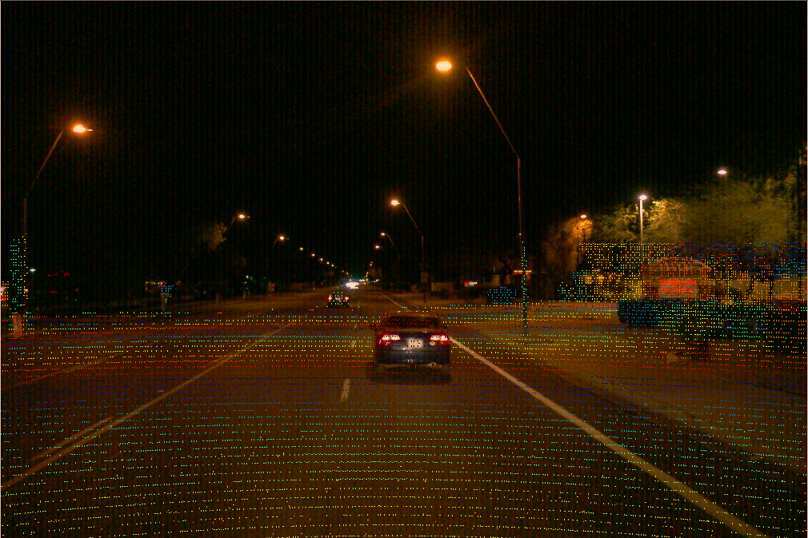
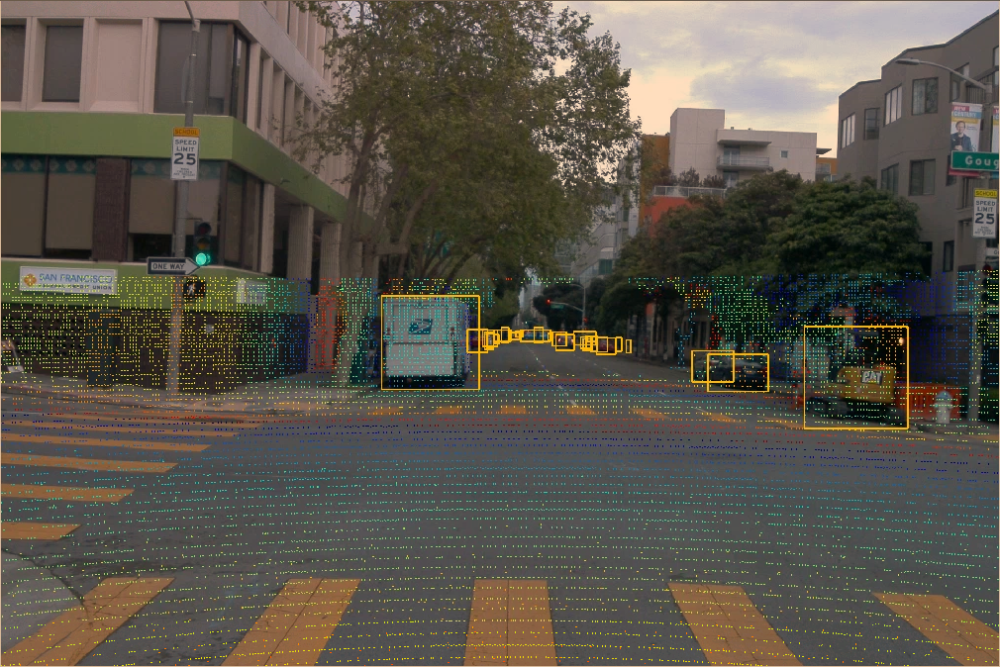
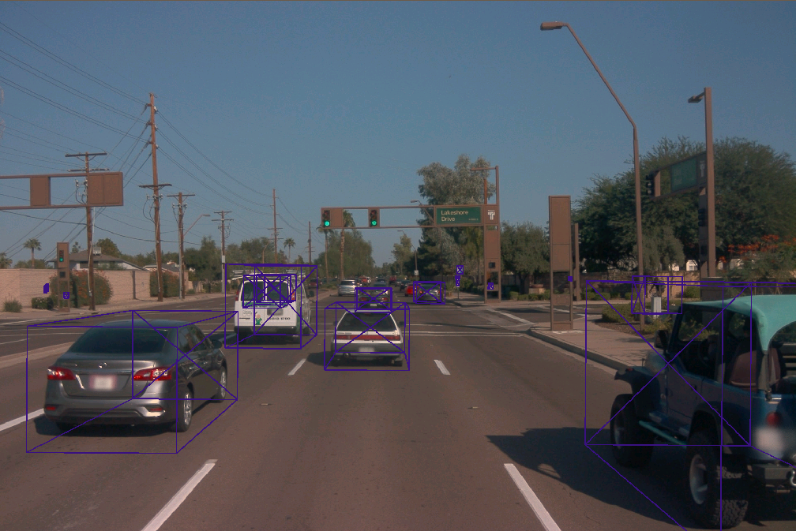
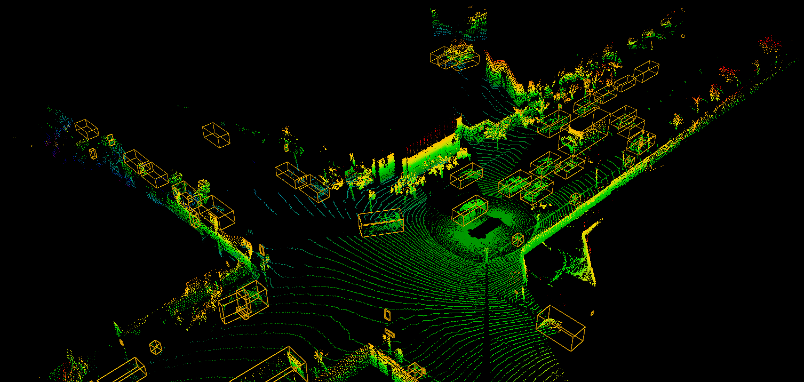

# Waymo-Toolkit
This is a toolkit for extracting elements (e.g. images, lasers and labels, which modified from offical [dataset.proto](https://github.com/waymo-research/waymo-open-dataset/blob/master/waymo_open_dataset/dataset.proto) defination to [annotation.proto](https://github.com/DapengFeng/waymo-toolkit/blob/master/waymo-toolkit/protos/annotation.proto)) from [Waymo Open Dataset](https://waymo.com/open) and visualizing the extracted images, laser points and labels with [OpenCV](https://opencv.org
) and [Mayavi](http://docs.enthought.com/mayavi/mayavi/)

## Installation
```
git clone https://github.com/DapengFeng/waymo-toolkit.git
cd waymo-toolkit
conda create -n waymo-toolkit python=3.7 vtk mayavi opencv
python setup.py install
```

## Extraction
```
/path/to/waymo_dataset
|---training
|   |---*.tfrecord
|---validation
|   |---*.tfrecord
|---testing
|   |---*.tfrecord
```
1. Extract all images
```
python tools/extract.py --source=/path/to/waymo_dataset --dest=/path/to/save_dir --type=all --image
```
2. Extract all laser points
```
python tools/extract.py --source=/path/to/waymo_dataset --dest=/path/to/save_dir --type=all --laser
```
3. Extract all labels and randomlly select 10% frames as the subset from the whole dataset. And I use the default random seed is 20200319, which is release date of waymo open dataset v1.2. You can change it to your own one, using the flag`--seed`
```
python tools/extract.py --source=/path/to/waymo_dataset --dest=/path/to/save_dir --type=all --label --subset
```

After the above steps, you can see the script will generate the following folders in the `/path/to/save_dir`. If you only want to extract the training data, you can change the flag `--type=all` to `--type=train`.

```
/path/to/save_dir
|---training
|   |---image_0 (FRONT)
|   |---image_1 (FRONT_LEFT)
|   |---image_2 (FRONT_RIGHT)
|   |---image_3 (SIDE_LEFT)
|   |---image_4 (SIDE_RIGHT)
|   |---laser (x,y,z)
|   |---laser_r (range)
|   |---laser_i (intensity)
|   |---laser_e (elongation)
|   |---label
|   |---split.txt
|---validation
|   |--- the same as training
|---testing
|   |--- the same as training (except the split.txt)
```

## Visualization

### Visualize the image

```
python tools/visualize.py --source=/path/to/save_dir --image --project
```


```
python tools/visualize.py --source=/path/to/save_dir --image --box2d --project
```


```
python tools/visualize.py --source=/path/to/save_dir --image --box3d
```


### Visualize the point cloud.
```
python tools/visualize.py --source=/path/to/save_dir --laser
```


## License
Waymo-Toolkit is released under the [Apache 2.0 license](LICENSE).

## Citing Waymo-Toolkit

If you use Waymo-Toolkit in your research, please use the following BibTeX entry.

```BibTeX
@misc{feng2020waymo-toolkit,
  author =       {Dapeng Feng},
  title =        {Waymo-Toolkit},
  howpublished = {\url{https://github.com/DapengFeng/waymo-toolkit}},
  year =         {2020}
}
```
